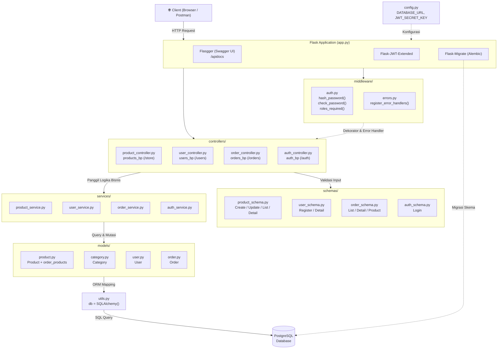

# Arsitektur Aplikasi Simple Shops

## Diagram

## Penjelasan Diagram

### Alur Request (dari atas ke bawah)

1. **Client** — Pengguna mengirim HTTP request (GET, POST, PUT, DELETE) ke server Flask. Bisa melalui browser, Postman, atau aplikasi frontend.

2. **Flask Application (`app.py`)** — Entry point aplikasi. Di sini Flask di-inisialisasi bersama extension-nya:
   - **Flasgger** — menghasilkan dokumentasi Swagger UI otomatis di `/apidocs`
   - **Flask-JWT-Extended** — menangani pembuatan dan validasi token JWT
   - **Flask-Migrate** — mengelola migrasi database menggunakan Alembic

3. **Middleware (`middleware/`)** — Lapisan yang menangani concern lintas fitur:
   - **`auth.py`** — berisi fungsi hashing password (`bcrypt`) dan dekorator `roles_required()` yang memproteksi endpoint berdasarkan role user (admin, seller, user)
   - **`errors.py`** — mengubah semua error HTTP (400, 404, 500) menjadi response JSON yang konsisten

4. **Controllers (`controllers/`)** — Lapisan tipis yang menerima request. Tugasnya:
   - Mengambil data dari request body/query parameter
   - Memvalidasi input menggunakan schema
   - Memanggil service yang sesuai
   - Mengembalikan response JSON ke client
   - Setiap controller memiliki satu Blueprint dengan URL prefix-nya masing-masing

5. **Schemas (`schemas/`)** — Lapisan DTO (Data Transfer Object) menggunakan Marshmallow:
   - **Load** — memvalidasi data input (tipe data, required fields, panjang string, range angka)
   - **Dump** — mengubah objek model menjadi JSON response yang bersih (tanpa field sensitif seperti password)

6. **Services (`services/`)** — Lapisan logika bisnis. Di sinilah "kerja nyata" terjadi:
   - Query database (filter, pagination)
   - Validasi bisnis (cek apakah kategori ada, cek duplikasi email)
   - Operasi CRUD (create, read, update, delete)
   - Error handling dan rollback transaksi

7. **Models (`models/`)** — Definisi struktur tabel database menggunakan SQLAlchemy ORM:
   - Setiap model merepresentasikan satu tabel di PostgreSQL
   - Mendefinisikan kolom, foreign key, dan relationship antar tabel
   - Memiliki method `to_dict()` untuk serialisasi sederhana

8. **Utils (`utils.py`)** — Berisi instance `db = SQLAlchemy()` yang digunakan oleh semua model. Diletakkan terpisah untuk menghindari circular import.

9. **PostgreSQL Database** — Tempat penyimpanan data permanen. Diakses melalui ORM (tidak ada raw SQL).

### Hubungan Antar Lapisan

| Dari | Ke | Jenis Hubungan |
|------|-----|---------------|
| Controller → Schema | Validasi input & serialisasi output |
| Controller → Service | Delegasi logika bisnis |
| Service → Model | Query dan mutasi data |
| Model → Utils (db) | Mapping ORM ke tabel database |
| Middleware → Controller | Dekorator proteksi (auth, error handling) |
| Config → App | Menyediakan environment variables |

### Prinsip Desain

- **Separation of Concerns** — setiap lapisan punya tanggung jawab tunggal
- **Thin Controllers** — controller tidak boleh berisi logika bisnis, hanya "terima request → panggil service → kirim response"
- **Fat Services** — semua logika bisnis terpusat di service layer
- **Single Direction** — data mengalir satu arah: Controller → Service → Model → Database

## Referensi

- [Flask Application Factory](https://flask.palletsprojects.com/en/latest/patterns/appfactories/)
- [Clean Architecture](https://blog.cleancoder.com/uncle-bob/2012/08/13/the-clean-architecture.html)
- [MVC Pattern](https://en.wikipedia.org/wiki/Model%E2%80%93view%E2%80%93controller)
