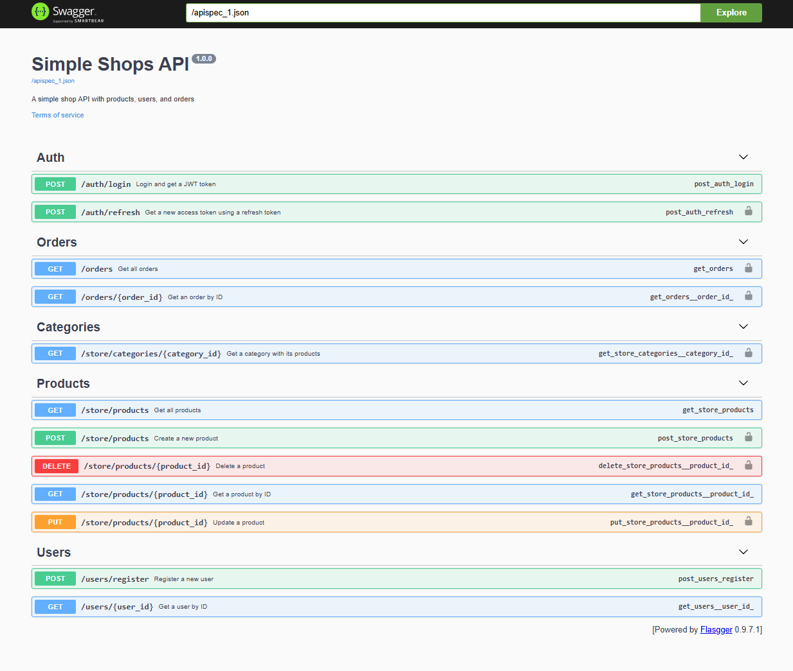

# Swagger / Dokumentasi API

## Apa Itu Swagger?

Swagger adalah tools untuk membuat **dokumentasi API interaktif** secara otomatis. Hasilnya adalah halaman web yang menampilkan semua endpoint API beserta cara pakainya — dan kamu bisa langsung test dari browser!

## Kenapa Butuh Dokumentasi API?

Bayangkan kamu bikin API, lalu developer frontend mau pakai. Mereka perlu tahu:
- Endpoint apa saja yang tersedia?
- URL-nya apa?
- Harus kirim data apa (body, parameter)?
- Response-nya seperti apa?
- Perlu login atau tidak?

Tanpa dokumentasi, frontend developer harus baca source code kamu — tidak efisien. Swagger menyelesaikan masalah ini.

## Flasgger

Di project ini kita pakai **Flasgger**, yaitu library Flask yang menggenerate Swagger UI dari docstring di route handler.

### Setup

```python
# app/__init__.py
from flasgger import Swagger

def init_app():
    app = Flask(__name__)
    swagger = Swagger(app)  # Inisialisasi Swagger
    return app
```

```python
# app/config.py
class Config:
    SWAGGER = {
        'title': 'Simple Shops API',
        'uiversion': 3,
        'version': '1.0.0',
        'description': 'A simple shop API with products, users, and orders',
    }
```

Setelah server berjalan, buka: `http://localhost:5000/apidocs`

## Cara Menulis Dokumentasi

Dokumentasi ditulis sebagai **docstring** di dalam fungsi route, menggunakan format YAML:

```python
@products_bp.route('/products', methods=['GET'])
def get_products():
    """Get all products
    ---
    tags:
      - Products
    parameters:
      - in: query
        name: page
        type: integer
        required: false
        default: 1
        description: Page number for pagination
      - in: query
        name: per_page
        type: integer
        required: false
        default: 10
        description: Number of items per page
    responses:
      200:
        description: A paginated list of products
        schema:
          type: object
          properties:
            products:
              type: array
              items:
                type: object
                properties:
                  id:
                    type: integer
                  name:
                    type: string
                  price:
                    type: number
            page:
              type: integer
            total:
              type: integer
    """
    # ... implementasi route ...
```

### Struktur Docstring

```yaml
"""Judul endpoint singkat
---
tags:                          # Grup/kategori endpoint
  - Products
security:                      # Kalau butuh JWT
  - Bearer: []
parameters:                    # Input yang diterima
  - in: query/path/body        # Lokasi parameter
    name: field_name
    type: string/integer/number
    required: true/false
    description: Penjelasan
responses:                     # Kemungkinan response
  200:
    description: Sukses
    schema:
      type: object
      properties: ...
  404:
    description: Not found
"""
```

### Lokasi Parameter (`in`)

| Lokasi | Contoh | Penjelasan |
|--------|--------|------------|
| `query` | `?page=2&name=widget` | Di URL setelah `?` |
| `path` | `/products/5` | Bagian dari URL |
| `body` | `{"name": "Widget"}` | Di body request (JSON) |

### Contoh: Endpoint dengan Body

```python
@products_bp.route('/products', methods=['POST'])
def create_product():
    """Create a new product
    ---
    tags:
      - Products
    security:
      - Bearer: []
    parameters:
      - in: body
        name: body
        required: true
        schema:
          type: object
          required:
            - name
            - sku
            - price
          properties:
            name:
              type: string
              example: "Widget"
            sku:
              type: string
              example: "WDG-001"
            price:
              type: number
              example: 19.99
    responses:
      201:
        description: Product created successfully
      400:
        description: Validation error
      401:
        description: Unauthorized
    """
```

### Contoh: Endpoint dengan Path Parameter

```python
@products_bp.route('/products/<int:product_id>', methods=['GET'])
def get_product(product_id):
    """Get a product by ID
    ---
    tags:
      - Products
    parameters:
      - in: path
        name: product_id
        type: integer
        required: true
        description: The product ID
    responses:
      200:
        description: Product details
      404:
        description: Product not found
    """
```

## Menggunakan Swagger UI

Setelah `flask run`, buka `http://localhost:5000/apidocs`:



1. **Lihat semua endpoint** — dikelompokkan berdasarkan tags
2. **Klik endpoint** — lihat detail parameter dan response
3. **Try it out** — klik tombol ini untuk test endpoint langsung
4. **Authorize** — masukkan JWT token untuk test endpoint yang butuh auth

### Cara Test Endpoint yang Butuh Auth:

1. Hit endpoint `/auth/login` dulu, copy `access_token` dari response
2. Klik tombol "Authorize" di atas
3. Masukkan: `Bearer <token_kamu>`
4. Sekarang bisa test endpoint yang butuh JWT

## Tips Menulis Dokumentasi Swagger

1. **Judul singkat dan jelas** — `"Get all products"` ✅, `"This endpoint gets products"` ❌
2. **Sertakan example** — Memudahkan frontend developer
3. **Dokumentasikan semua response code** — 200, 400, 401, 403, 404, 500
4. **Gunakan tags** untuk grouping — Products, Users, Orders, Auth
5. **Tandai field required** — Di `schema.required` array

## File Terkait di Project Ini

- `app/controllers/` — Docstring swagger ada di setiap route handler (controller)
- `app/config.py` — Konfigurasi Swagger (title, version, description, security)
- `app/__init__.py` — Inisialisasi Flasgger

## Referensi

- [Flasgger Documentation](https://github.com/flasgger/flasgger)
- [OpenAPI Specification](https://swagger.io/specification/)
- [Swagger Editor](https://editor.swagger.io/) — Untuk preview YAML spec
